# Requirements Analysis Document (RAD) — Modello dei casi d'uso e modello dinamico
## Sistema di Gestione Identità Digitale AFAM (versione WEB)

> Documento rigenerato sul **sistema web realmente implementato** (Spring Boot 3 REST API +
> React SPA, PostgreSQL). Segue lo stile dell'esempio 30/30: use case in forma tabellare con
> loop **FINCHÉ** e frammenti **SE/ALTRIMENTI** (resi come `alt` a due guardie), diagrammi dei
> casi d'uso, sequence e class diagram per ogni sottosistema, con le funzioni complete nelle classi.

---

## CONVENZIONI DI MODELLAZIONE

### Stereotipi e ordine delle lifeline nei sequence
`:Attore` → `:XxxBND` (schermate coinvolte) → `:XxxCTRL` (controller dell'UC) →
`:MessaggioBND` / `:ErroreBND` → `:StudenteAFAM` e altre **entity** (quando si recuperano dati
a partire dal token/matricola dell'utente) → `:DBMSBND` (boundary del DB) → `DBMS` (attore) →
eventuali provider esterni (Mail, SPID/eIDAS).

### Regole
- **DBMS è un attore**, ma prima di esso c'è **SEMPRE** la boundary `DBMSBND`
  (`...CTRL → DBMSBND.queryXxx() → DBMS`).
- Quando l'operazione **recupera/salva dati a partire dal token dell'utente autenticato**,
  compare l'**entity `StudenteAFAM`**: il CTRL chiama `StudenteAFAM.getMatricola()` e con la
  matricola il `DBMSBND` interroga il DBMS.
- **FINCHÉ** (loop che trattiene l'utente nell'UC) → frame `loop [guardia]`.
- **SE … ALTRIMENTI** → un unico frame `alt` con due scomparti e due guardie distinte.
- Invocazione di un altro UC → frame `ref`.
- Ogni sequence parte e termina dalla schermata coerente col contesto (pubblico →
  `BachecaPubblica`; autenticato → `Dashboard`/schermata pertinente).

### Attori del sistema
- **Studente** (utente autenticato, proprietario del portfolio)
- **Revisore** (utente autenticato con ruolo REVISORE, modera le segnalazioni)
- **Utente** (generalizzazione di Studente e Revisore)
- **Utente Esterno** (non autenticato: bacheca, ricerca, profili pubblici, link, segnalazioni)
- **DBMS**, **Mail Provider**, **Provider SPID/eIDAS** (esterni)

### Boundary (schermate React reali)
`BachecaPubblicaBND` (index), `LoginBND`, `RegistrazioneBND`, `Verifica2FABND`, `DashboardBND`,
`ArchivioBND`, `CreaPortfolioBND`, `ModificaPortfolioBND`, `GestionePortfolioBND`,
`ProfiloPubblicoBND`, `ElencoOpereBND`, `ElencoPortfoliosBND`, `VisualizzatorePortfolioBND`,
`VisualizzatoreLinkBND`, `FormSegnalazioneBND`, `PannelloRevisioneBND`, `ImpostazioniProfiloBND`,
`NotificheBND`, `MessaggioBND`, `ErroreBND`, `DBMSBND`.

---
---

# SOTTOSISTEMA A — AUTENTICAZIONE

## A.1 Diagramma dei casi d'uso (PlantUML)

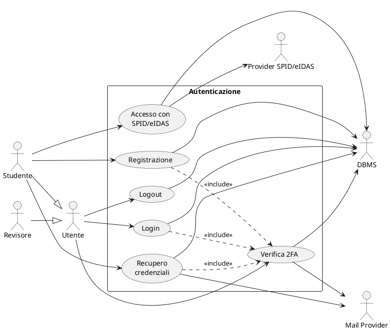

## A.2 Use case — flussi degli eventi

### LOGIN

| **Caso d'uso** | Login |
|---|---|
| **ID** | LOGIN |
| **Attori** | • Utente (Studente o Revisore) • DBMS |
| **Precondizioni** | Il sistema ha mostrato a video la schermata "Bacheca pubblica" (index) |
| **Flusso eventi** | 1. L'utente clicca il pulsante "Accedi" sulla schermata visualizzata |
| | 2. Il sistema mostra a video la schermata di login |
| | 3. L'utente inserisce email istituzionale e password |
| | 4. L'utente preme il tasto "Accedi" |
| | 5. Il sistema verifica il formato dei campi inseriti |
| | 6. Il sistema, tramite DBMSBND, interroga il DBMS per verificare le credenziali |
| | 7. **FINCHÉ** le credenziali non corrispondono oppure il formato è errato |
| | &nbsp;&nbsp; 7.1 **SE** il formato dei campi è errato |
| | &nbsp;&nbsp;&nbsp;&nbsp; 7.1.1 Il sistema mostra il messaggio "Formato non valido, riprova" |
| | &nbsp;&nbsp;&nbsp;&nbsp; 7.1.2 L'utente clicca "OK" sul messaggio |
| | &nbsp;&nbsp; 7.2 **ALTRIMENTI** |
| | &nbsp;&nbsp;&nbsp;&nbsp; 7.2.1 Il sistema mostra il messaggio "Le credenziali non corrispondono, riprova" |
| | &nbsp;&nbsp;&nbsp;&nbsp; 7.2.2 L'utente clicca "OK" sul messaggio |
| | &nbsp;&nbsp; 7.3 Il sistema mostra la schermata di login |
| | &nbsp;&nbsp; 7.4 L'utente inserisce email e password |
| | &nbsp;&nbsp; 7.5 L'utente preme "Accedi" |
| | &nbsp;&nbsp; 7.6 Il sistema verifica il formato |
| | &nbsp;&nbsp; 7.7 Il sistema, tramite DBMSBND, interroga il DBMS per verificare le credenziali |
| | 8. Il sistema mostra la schermata di verifica 2FA |
| | 9. Il sistema invoca il caso d'uso "Verifica 2FA" |
| | 10. Il sistema mostra il messaggio "Verifica riuscita" |
| | 11. L'utente clicca "OK" |
| | 12. Il sistema, tramite DBMSBND, registra la sessione (emissione token JWT) |
| | 13. Il sistema mostra la schermata principale dell'utente |
| **Postcondizioni** | Il sistema ha mostrato la schermata principale dell'utente |
| **Note** | Schermata principale = "Dashboard" (Studente) o "Pannello di revisione" (Revisore). Verifica credenziali con bcrypt; sessione via token JWT. |

### VERIFICA 2FA

| **Caso d'uso** | Verifica 2FA |
|---|---|
| **ID** | VER_2FA |
| **Attori** | • Utente • DBMS |
| **Precondizioni** | Il sistema ha mostrato la schermata di verifica 2FA |
| **Flusso eventi** | 1. L'utente digita il codice TOTP generato dalla propria app di autenticazione |
| | 2. L'utente clicca "Verifica" |
| | 3. Il sistema, tramite DBMSBND, recupera il segreto TOTP associato all'utente |
| | 4. Il sistema verifica che il codice sia valido nella finestra temporale corrente |
| | 5. **FINCHÉ** il codice non è valido |
| | &nbsp;&nbsp; 5.1 Il sistema mostra il messaggio "Codice errato" |
| | &nbsp;&nbsp; 5.2 L'utente clicca "OK" |
| | &nbsp;&nbsp; 5.3 L'utente digita nuovamente il codice TOTP |
| | &nbsp;&nbsp; 5.4 L'utente clicca "Verifica" |
| | &nbsp;&nbsp; 5.5 Il sistema verifica il codice |
| | 6. Il sistema mostra il messaggio "Verifica riuscita" |
| **Postcondizioni** | Il sistema ha mostrato il messaggio "Verifica riuscita" |
| **Note** | Il codice TOTP (dev.samstevens.totp) è valido per la finestra temporale di 30s. Il segreto è generato alla registrazione e mostrato come QR. |

### REGISTRAZIONE

| **Caso d'uso** | Registrazione |
|---|---|
| **ID** | SIGNUP |
| **Attori** | • Studente • DBMS |
| **Precondizioni** | Il sistema ha mostrato la schermata "Bacheca pubblica" (index) |
| **Flusso eventi** | 1. Lo studente clicca "Accedi", poi "Non hai un account? Registrati" |
| | 2. Il sistema mostra il form di registrazione |
| | 3. Lo studente compila il form (matricola, nome, cognome, email istituzionale, password) |
| | 4. Lo studente clicca "Registrati" |
| | 5. Il sistema verifica il formato dei campi e della password |
| | 6. Il sistema, tramite DBMSBND, verifica se la matricola/email risulta già registrata |
| | 7. **SE** l'utente non risulta registrato |
| | &nbsp;&nbsp; 7.1 **FINCHÉ** il formato della password non è valido |
| | &nbsp;&nbsp;&nbsp;&nbsp; 7.1.1 Il sistema mostra "Formato password non valido, riprova" |
| | &nbsp;&nbsp;&nbsp;&nbsp; 7.1.2 Lo studente clicca "OK" |
| | &nbsp;&nbsp;&nbsp;&nbsp; 7.1.3 Lo studente reinserisce la password |
| | &nbsp;&nbsp;&nbsp;&nbsp; 7.1.4 Il sistema verifica il formato |
| | &nbsp;&nbsp; 7.2 Il sistema, tramite DBMSBND, salva lo studente (password cifrata bcrypt) e il segreto TOTP |
| | &nbsp;&nbsp; 7.3 Il sistema mostra il QR per configurare la 2FA e il messaggio "Registrazione riuscita" |
| | &nbsp;&nbsp; 7.4 Lo studente clicca "OK" |
| | &nbsp;&nbsp; 7.5 Il sistema mostra la schermata di login |
| | 8. **ALTRIMENTI** |
| | &nbsp;&nbsp; 8.1 Il sistema mostra "Utente già registrato, effettua il login" |
| | &nbsp;&nbsp; 8.2 Lo studente clicca "OK" |
| | &nbsp;&nbsp; 8.3 Il sistema mostra la schermata di login |
| **Postcondizioni** | Il sistema ha mostrato la schermata di login |
| **Note** | La registrazione richiede email di dominio AFAM. Il segreto TOTP è generato dal sistema e configurato dallo studente tramite QR (2FA obbligatoria). |

### ACCESSO CON SPID/eIDAS *(stub)*

| **Caso d'uso** | Accesso con SPID/eIDAS |
|---|---|
| **ID** | ACC_FED |
| **Attori** | • Studente • Provider SPID/eIDAS • DBMS |
| **Precondizioni** | Il sistema ha mostrato la schermata di login |
| **Flusso eventi** | 1. Lo studente clicca "Accedi con SPID" (o eIDAS) |
| | 2. Il sistema, tramite il provider di identità (stub), avvia il flusso di autenticazione federata |
| | 3. Il provider restituisce l'esito dell'autenticazione e gli attributi identificativi |
| | 4. Il sistema, tramite DBMSBND, verifica se lo studente è già registrato |
| | 5. **SE** lo studente è già registrato |
| | &nbsp;&nbsp; 5.1 Il sistema, tramite DBMSBND, aggiorna l'identità federata |
| | 6. **ALTRIMENTI** |
| | &nbsp;&nbsp; 6.1 Il sistema, tramite DBMSBND, registra lo studente e l'identità federata |
| | 7. Il sistema registra la sessione (JWT) e mostra la "Dashboard" |
| **Postcondizioni** | Il sistema ha mostrato la "Dashboard" |
| **Note** | Il modulo SPID/eIDAS è modellato ma **implementato come stub** (ProviderSPIDeIDAS), in vista di una futura integrazione reale AgID/eIDAS. |

### RECUPERO CREDENZIALI

| **Caso d'uso** | Recupero credenziali |
|---|---|
| **ID** | REC_PASS |
| **Attori** | • Studente • Mail Provider • DBMS |
| **Precondizioni** | Il sistema ha mostrato la schermata di login |
| **Flusso eventi** | 1. Lo studente clicca "Recupera password" |
| | 2. Il sistema mostra il form di richiesta recupero |
| | 3. Lo studente inserisce la propria email istituzionale |
| | 4. Lo studente clicca "Invia" |
| | 5. Il sistema, tramite DBMSBND, verifica l'esistenza dell'account |
| | 6. **SE** l'account esiste |
| | &nbsp;&nbsp; 6.1 Il sistema genera un token di reset a scadenza (SecureRandom) e, tramite DBMSBND, lo salva |
| | &nbsp;&nbsp; 6.2 Il sistema, tramite il Mail Provider, invia il link di reset all'email |
| | 7. Il sistema mostra il messaggio "Se l'account esiste, riceverai un'email" |
| | 8. Lo studente clicca "OK" |
| | 9. Il sistema mostra la schermata di login |
| **Postcondizioni** | Il sistema ha mostrato la schermata di login |
| **Note** | Il messaggio è volutamente generico per non rivelare l'esistenza dell'account (privacy). Il token di reset ha scadenza; alla conferma si imposta la nuova password (bcrypt). |

### LOGOUT

| **Caso d'uso** | Logout |
|---|---|
| **ID** | LOGOUT |
| **Attori** | • Utente |
| **Precondizioni** | L'utente è autenticato (sessione JWT attiva) |
| **Flusso eventi** | 1. L'utente clicca "Esci" nella barra di navigazione |
| | 2. Il sistema invalida il token di sessione lato client |
| | 3. Il sistema mostra a video la schermata "Bacheca pubblica" (index) |
| **Postcondizioni** | Il sistema ha mostrato la "Bacheca pubblica" |
| **Note** | Essendo l'autenticazione stateless (JWT), il logout rimuove il token dal client; non è richiesta un'invalidazione server-side. |

## A.3 Sequence diagram (PlantUML)

### SEQ — Login

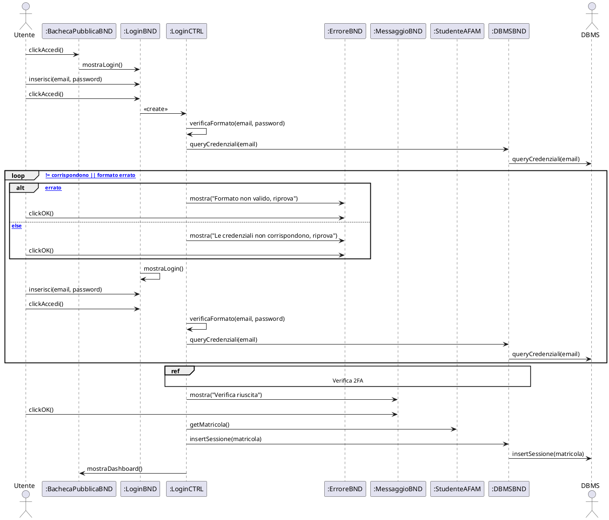

### SEQ — Verifica 2FA

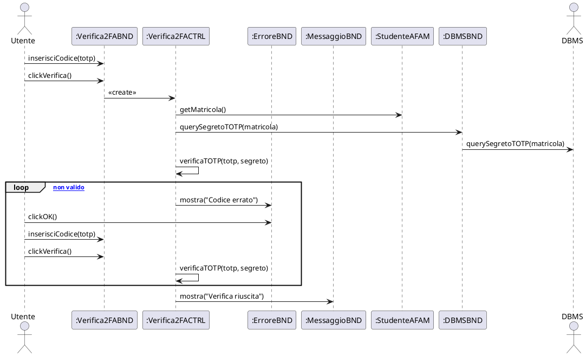

### SEQ — Registrazione

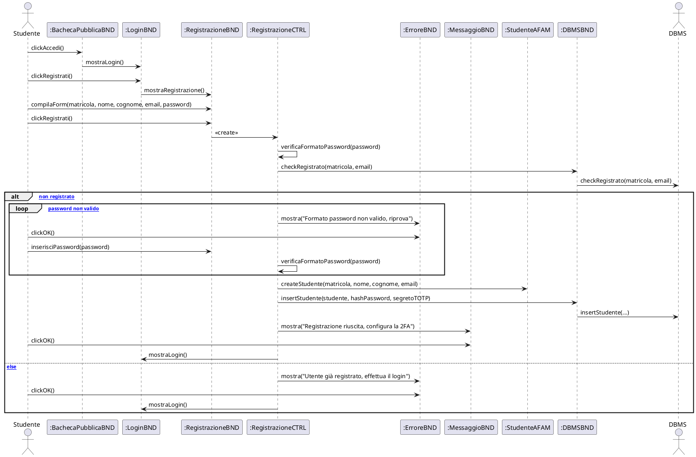

### SEQ — Accesso con SPID/eIDAS

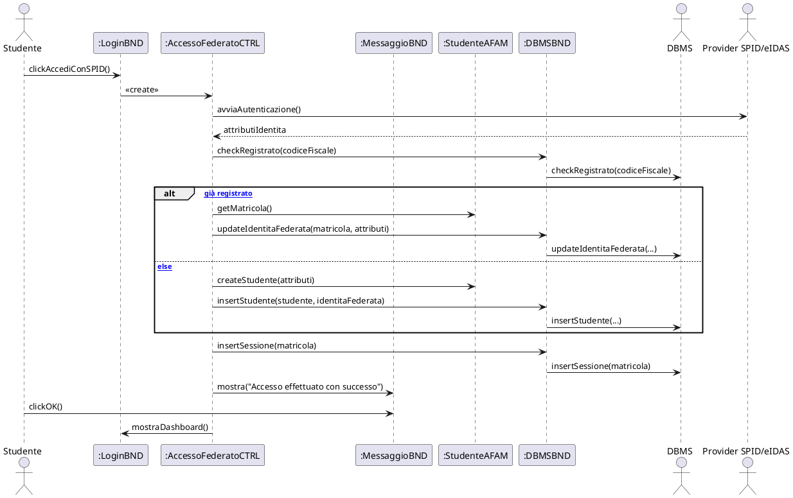

### SEQ — Recupero credenziali

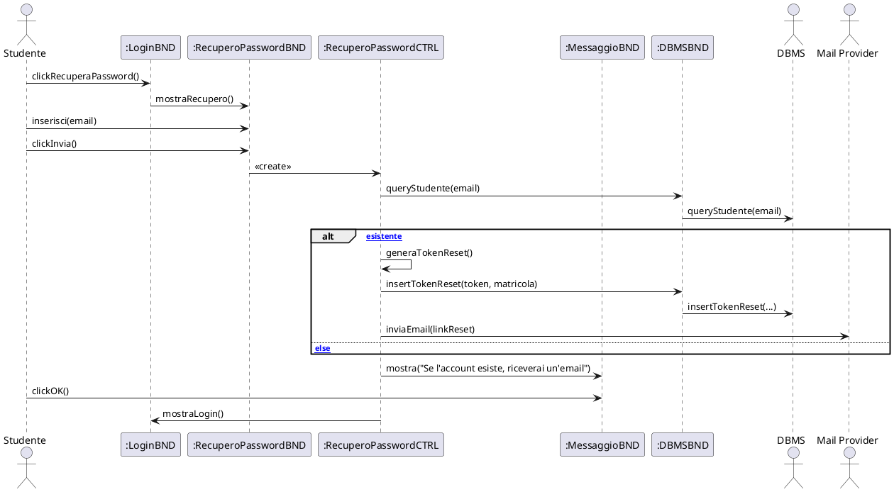

### SEQ — Logout

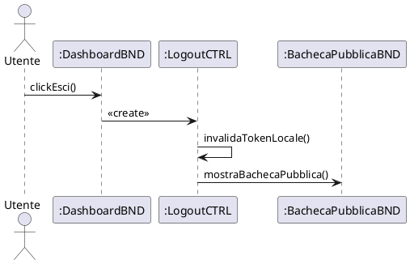

## A.4 Diagramma delle classi — Autenticazione (PlantUML, funzioni complete)

```plantuml
@startuml CLS_Autenticazione
skinparam classAttributeIconSize 0
package "Autenticazione" {

  class BachecaPubblicaBND <<boundary>> {
    +mostraBachecaPubblica()
    +clickAccedi()
    +clickRicercaProfili()
  }
  class LoginBND <<boundary>> {
    +mostraLogin()
    +inserisci(email, password)
    +clickAccedi()
    +clickAccediConSPID()
    +clickRecuperaPassword()
    +clickRegistrati()
    +mostraDashboard()
  }
  class RegistrazioneBND <<boundary>> {
    +mostraRegistrazione()
    +compilaForm()
    +inserisciPassword(password)
    +clickRegistrati()
  }
  class Verifica2FABND <<boundary>> {
    +mostraVerifica2FA()
    +inserisciCodice(totp)
    +clickVerifica()
  }
  class RecuperoPasswordBND <<boundary>> {
    +mostraRecupero()
    +inserisci(email)
    +clickInvia()
  }
  class MessaggioBND <<boundary>> { +mostra() +clickOK() }
  class ErroreBND <<boundary>> { +mostra() +clickOK() }

  class LoginCTRL <<control>> {
    +createLogin()
    +verificaFormato()
    +checkRuolo()
  }
  class Verifica2FACTRL <<control>> {
    +createVerifica2FA()
    +verificaTOTP()
  }
  class RegistrazioneCTRL <<control>> {
    +createRegistrazione()
    +verificaFormatoPassword()
  }
  class AccessoFederatoCTRL <<control>> {
    +createAccessoFederato()
    +avviaAutenticazione()
  }
  class RecuperoPasswordCTRL <<control>> {
    +createRecuperoPassword()
    +generaTokenReset()
  }
  class LogoutCTRL <<control>> {
    +createLogout()
    +invalidaTokenLocale()
  }

  class StudenteAFAM <<entity>> {
    -matricola
    -nome
    -cognome
    -emailIstituzionale
    -avatarPath
    -visibilitaProfilo
    +createStudente()
    +getMatricola()
    +getDatiStudente()
    +getEmail()
    +setEmail()
    +setAvatar()
  }

  class DBMSBND <<boundary>> {
    +queryCredenziali()
    +queryStudente()
    +querySegretoTOTP()
    +checkRegistrato()
    +insertStudente()
    +insertSessione()
    +insertTokenReset()
    +updateIdentitaFederata()
    +updatePassword()
  }

  LoginBND ..> LoginCTRL
  Verifica2FABND ..> Verifica2FACTRL
  RegistrazioneBND ..> RegistrazioneCTRL
  RecuperoPasswordBND ..> RecuperoPasswordCTRL
  LoginCTRL ..> StudenteAFAM
  LoginCTRL ..> DBMSBND
  Verifica2FACTRL ..> StudenteAFAM
  Verifica2FACTRL ..> DBMSBND
  RegistrazioneCTRL ..> StudenteAFAM
  RegistrazioneCTRL ..> DBMSBND
  AccessoFederatoCTRL ..> StudenteAFAM
  AccessoFederatoCTRL ..> DBMSBND
  RecuperoPasswordCTRL ..> DBMSBND
}
@enduml
```

---
---

# SOTTOSISTEMA B — GESTIONE PROFILO

## B.1 Diagramma dei casi d'uso (PlantUML)

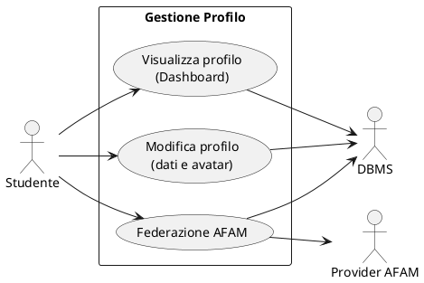

## B.2 Use case — flussi degli eventi

### VISUALIZZA PROFILO (DASHBOARD)

| **Caso d'uso** | Visualizza profilo |
|---|---|
| **ID** | VIS_PROF |
| **Attori** | • Studente • DBMS |
| **Precondizioni** | Lo studente è autenticato |
| **Flusso eventi** | 1. Lo studente clicca "Dashboard" nella barra di navigazione |
| | 2. Il sistema recupera la matricola dal token dell'utente autenticato |
| | 3. Il sistema, tramite DBMSBND, richiede i dati del profilo e i contenuti caricati dallo studente |
| | 4. Il sistema mostra a video la schermata "Dashboard" con dati anagrafici, opere e portfolio |
| **Postcondizioni** | Il sistema ha mostrato a video la "Dashboard" |
| **Note** | La Dashboard riepiloga profilo, anteprime di opere e portfolio dello studente. |

### MODIFICA PROFILO (DATI E AVATAR)

| **Caso d'uso** | Modifica profilo |
|---|---|
| **ID** | MOD_PROF |
| **Attori** | • Studente • DBMS |
| **Precondizioni** | Il sistema ha mostrato la schermata "Impostazioni profilo" |
| **Flusso eventi** | 1. Lo studente modifica uno o più campi (nome visualizzato, bio, visibilità profilo) e/o seleziona una nuova immagine avatar |
| | 2. Lo studente clicca "Salva" |
| | 3. Il sistema verifica il formato dei campi e, per l'avatar, tipo e dimensione del file |
| | 4. **FINCHÉ** i dati non sono validi |
| | &nbsp;&nbsp; 4.1 Il sistema mostra il messaggio "Dati non validi, riprova" |
| | &nbsp;&nbsp; 4.2 Lo studente clicca "OK" |
| | &nbsp;&nbsp; 4.3 Lo studente corregge i campi |
| | &nbsp;&nbsp; 4.4 Lo studente clicca "Salva" |
| | &nbsp;&nbsp; 4.5 Il sistema verifica nuovamente il formato |
| | 5. Il sistema recupera la matricola dal token dell'utente |
| | 6. Il sistema, tramite DBMSBND, aggiorna i dati del profilo (ed eventualmente l'avatar) |
| | 7. Il sistema mostra il messaggio "Profilo aggiornato con successo" |
| | 8. Lo studente clicca "OK" |
| | 9. Il sistema mostra la schermata "Impostazioni profilo" aggiornata |
| **Postcondizioni** | Il sistema ha mostrato la schermata "Impostazioni profilo" aggiornata |
| **Note** | L'avatar è salvato come risorsa; formati e dimensione massima sono validati lato server. |

### FEDERAZIONE AFAM *(stub)*

| **Caso d'uso** | Federazione AFAM |
|---|---|
| **ID** | FED_AFAM |
| **Attori** | • Studente • Provider AFAM • DBMS |
| **Precondizioni** | Il sistema ha mostrato la schermata "Impostazioni profilo" |
| **Flusso eventi** | 1. Lo studente clicca "Collega istituto AFAM" |
| | 2. Lo studente seleziona il proprio istituto |
| | 3. Lo studente clicca "Conferma" |
| | 4. Il sistema recupera la matricola dal token dell'utente |
| | 5. Il sistema genera un identificativo federato e, tramite il Provider AFAM (stub), trasmette il riferimento |
| | 6. **SE** il provider conferma |
| | &nbsp;&nbsp; 6.1 Il sistema, tramite DBMSBND, salva l'identità federata |
| | &nbsp;&nbsp; 6.2 Il sistema mostra il messaggio "Istituto collegato con successo" |
| | 7. **ALTRIMENTI** |
| | &nbsp;&nbsp; 7.1 Il sistema mostra il messaggio "Servizio di federazione non disponibile" |
| | 8. Lo studente clicca "OK" |
| | 9. Il sistema mostra la schermata "Impostazioni profilo" |
| **Postcondizioni** | Il sistema ha mostrato la schermata "Impostazioni profilo" |
| **Note** | Il modulo di federazione è **implementato come stub** (ProviderAFAM): in questa fase la trasmissione del riferimento non è ancora operativa verso un provider reale. |

## B.3 Sequence diagram (PlantUML)

### SEQ — Visualizza profilo (Dashboard)

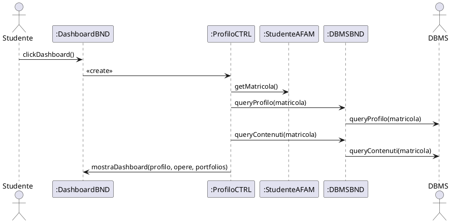

### SEQ — Modifica profilo

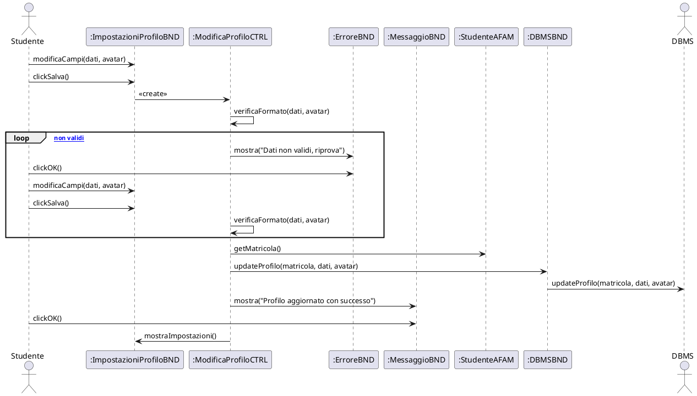

### SEQ — Federazione AFAM

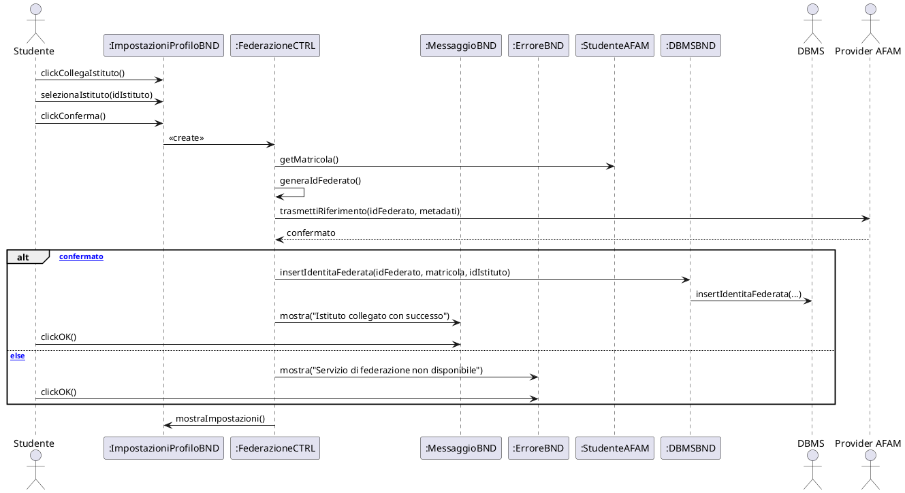

## B.4 Diagramma delle classi — Gestione Profilo (PlantUML, funzioni complete)

```plantuml
@startuml CLS_GestioneProfilo
skinparam classAttributeIconSize 0
package "Gestione Profilo" {

  class DashboardBND <<boundary>> {
    +mostraDashboard()
    +clickDashboard()
    +clickImpostazioni()
  }
  class ImpostazioniProfiloBND <<boundary>> {
    +mostraImpostazioni()
    +modificaCampi(dati, avatar)
    +selezionaIstituto(idIstituto)
    +clickSalva()
    +clickCollegaIstituto()
    +clickConferma()
  }
  class MessaggioBND <<boundary>> { +mostra() +clickOK() }
  class ErroreBND <<boundary>> { +mostra() +clickOK() }

  class ProfiloCTRL <<control>> {
    +createProfilo()
  }
  class ModificaProfiloCTRL <<control>> {
    +createModificaProfilo()
    +verificaFormato()
  }
  class FederazioneCTRL <<control>> {
    +createFederazione()
    +generaIdFederato()
  }

  class StudenteAFAM <<entity>> {
    -matricola
    -nome
    -cognome
    -emailIstituzionale
    -bio
    -avatarPath
    -visibilitaProfilo
    +getMatricola()
    +getDatiStudente()
    +setNome()
    +setBio()
    +setAvatar()
    +setVisibilita()
  }
  class IdentitaFederata <<entity>> {
    -idFederato
    -matricola
    -idIstitutoEsterno
    -dataAttivazione
    +createIdentitaFederata()
    +getIdFederato()
  }

  class DBMSBND <<boundary>> {
    +queryProfilo()
    +queryContenuti()
    +updateProfilo()
    +insertIdentitaFederata()
  }

  DashboardBND ..> ProfiloCTRL
  ImpostazioniProfiloBND ..> ModificaProfiloCTRL
  ImpostazioniProfiloBND ..> FederazioneCTRL
  ProfiloCTRL ..> StudenteAFAM
  ProfiloCTRL ..> DBMSBND
  ModificaProfiloCTRL ..> StudenteAFAM
  ModificaProfiloCTRL ..> DBMSBND
  FederazioneCTRL ..> StudenteAFAM
  FederazioneCTRL ..> IdentitaFederata
  FederazioneCTRL ..> DBMSBND
}
@enduml
```

---
---

# SOTTOSISTEMA C — GESTIONE CONTENUTI

## C.1 Diagramma dei casi d'uso (PlantUML)

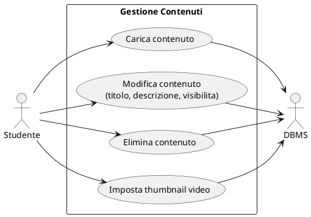

## C.2 Use case — flussi degli eventi

### CARICA CONTENUTO

| **Caso d'uso** | Carica contenuto |
|---|---|
| **ID** | CAR_CON |
| **Attori** | • Studente • DBMS |
| **Precondizioni** | Il sistema ha mostrato la schermata "Archivio" |
| **Flusso eventi** | 1. Lo studente clicca "Carica contenuto" |
| | 2. Il sistema mostra il form di caricamento |
| | 3. Lo studente seleziona un file dal proprio dispositivo |
| | 4. Il sistema propone automaticamente il titolo dal nome del file (modificabile) |
| | 5. Lo studente inserisce eventualmente descrizione e sceglie la visibilita (pubblico/privato) |
| | 6. Lo studente clicca "Carica" |
| | 7. Il sistema verifica tipo e dimensione del file |
| | 8. **FINCHÉ** il file non è valido |
| | &nbsp;&nbsp; 8.1 Il sistema mostra il messaggio "File non valido, riprova" |
| | &nbsp;&nbsp; 8.2 Lo studente clicca "OK" |
| | &nbsp;&nbsp; 8.3 Lo studente seleziona un nuovo file |
| | &nbsp;&nbsp; 8.4 Il sistema verifica tipo e dimensione |
| | 9. Il sistema recupera la matricola dal token dell'utente |
| | 10. Il sistema, tramite DBMSBND, salva il contenuto associandolo allo studente |
| | 11. Il sistema mostra il messaggio "Contenuto caricato" |
| | 12. Lo studente clicca "OK" |
| | 13. Il sistema mostra la schermata "Archivio" aggiornata |
| **Postcondizioni** | Il sistema ha mostrato la schermata "Archivio" aggiornata |
| **Note** | I tipi ammessi sono audio, video, spartiti e immagini/opere. Il titolo di default deriva dal nome del file ed è editabile. |

### MODIFICA CONTENUTO

| **Caso d'uso** | Modifica contenuto |
|---|---|
| **ID** | MOD_CON |
| **Attori** | • Studente • DBMS |
| **Precondizioni** | Il sistema ha mostrato la schermata "Archivio" |
| **Flusso eventi** | 1. Lo studente clicca "Modifica" sulla card del contenuto desiderato |
| | 2. Il sistema mostra il pannello di modifica (titolo, descrizione, visibilita) |
| | 3. Lo studente modifica uno o più campi |
| | 4. Lo studente clicca "Salva" |
| | 5. Il sistema verifica il formato dei campi |
| | 6. **FINCHÉ** i campi non sono validi |
| | &nbsp;&nbsp; 6.1 Il sistema mostra il messaggio "Dati non validi, riprova" |
| | &nbsp;&nbsp; 6.2 Lo studente clicca "OK" |
| | &nbsp;&nbsp; 6.3 Lo studente corregge i campi |
| | &nbsp;&nbsp; 6.4 Il sistema verifica il formato |
| | 7. Il sistema recupera la matricola dal token dell'utente |
| | 8. Il sistema, tramite DBMSBND, verifica che il contenuto appartenga allo studente e non sia RIMOSSO |
| | 9. Il sistema, tramite DBMSBND, aggiorna i campi modificati (aggiornamento parziale) |
| | 10. Il sistema mostra il messaggio "Contenuto aggiornato con successo" |
| | 11. Lo studente clicca "OK" |
| | 12. Il sistema mostra la schermata "Archivio" aggiornata |
| **Postcondizioni** | Il sistema ha mostrato la schermata "Archivio" aggiornata |
| **Note** | L'aggiornamento è parziale: i campi lasciati vuoti non vengono modificati. La visibilita è scelta tra PUBBLICO e PRIVATO; un contenuto RIMOSSO non è modificabile. |

### ELIMINA CONTENUTO

| **Caso d'uso** | Elimina contenuto |
|---|---|
| **ID** | DEL_CON |
| **Attori** | • Studente • DBMS |
| **Precondizioni** | Il sistema ha mostrato la schermata "Archivio" |
| **Flusso eventi** | 1. Lo studente clicca "Elimina" sulla card del contenuto |
| | 2. Il sistema mostra il messaggio "Sei sicuro di voler eliminare il contenuto?" |
| | 3. Lo studente clicca "Conferma" |
| | 4. Il sistema recupera la matricola dal token dell'utente |
| | 5. Il sistema, tramite DBMSBND, verifica che il contenuto appartenga allo studente |
| | 6. Il sistema, tramite DBMSBND, marca il contenuto come RIMOSSO |
| | 7. Il sistema mostra il messaggio "Contenuto eliminato" |
| | 8. Lo studente clicca "OK" |
| | 9. Il sistema mostra la schermata "Archivio" aggiornata |
| **Postcondizioni** | Il sistema ha mostrato la schermata "Archivio" aggiornata |
| **Note** | L'eliminazione imposta lo stato RIMOSSO; il contenuto non è più visibile né modificabile. |

### IMPOSTA THUMBNAIL VIDEO

| **Caso d'uso** | Imposta thumbnail video |
|---|---|
| **ID** | SET_THUMB |
| **Attori** | • Studente • DBMS |
| **Precondizioni** | Il sistema ha mostrato la schermata "Archivio" con un contenuto video |
| **Flusso eventi** | 1. Lo studente apre il pannello del contenuto video |
| | 2. Lo studente sceglie di caricare un'immagine di anteprima **oppure** di catturare un fotogramma dal video |
| | 3. **SE** lo studente carica un'immagine |
| | &nbsp;&nbsp; 3.1 Lo studente seleziona il file immagine |
| | 4. **ALTRIMENTI** |
| | &nbsp;&nbsp; 4.1 Il sistema cattura il fotogramma corrente dal player e lo converte in immagine |
| | 5. Il sistema verifica tipo e dimensione dell'immagine |
| | 6. Il sistema recupera la matricola dal token dell'utente |
| | 7. Il sistema, tramite DBMSBND, verifica la proprietà del contenuto e salva il percorso della thumbnail |
| | 8. Il sistema mostra il messaggio "Anteprima impostata" |
| | 9. Lo studente clicca "OK" |
| | 10. Il sistema mostra la schermata "Archivio" aggiornata |
| **Postcondizioni** | Il sistema ha mostrato la schermata "Archivio" con l'anteprima aggiornata |
| **Note** | La cattura del fotogramma avviene lato browser (canvas). In assenza di anteprima, il sistema mostra un'icona segnaposto. |

## C.3 Sequence diagram (PlantUML)

### SEQ — Carica contenuto

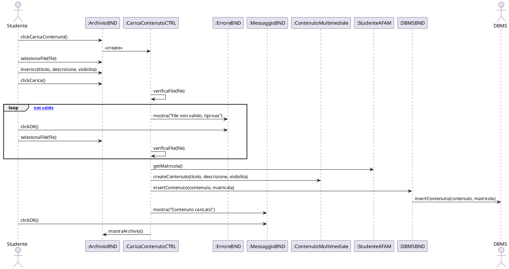

### SEQ — Modifica contenuto

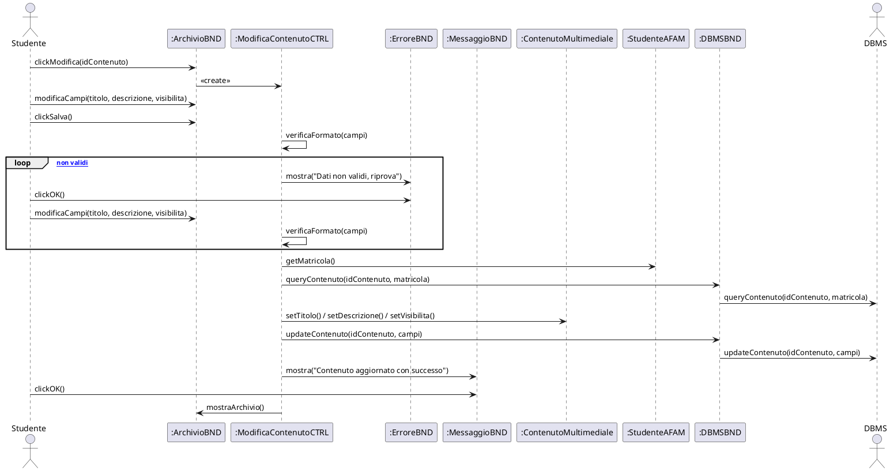

### SEQ — Elimina contenuto

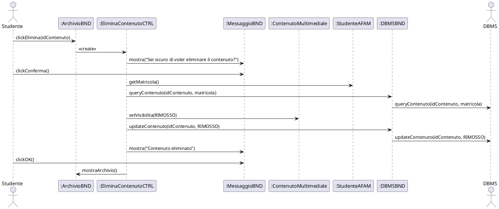

### SEQ — Imposta thumbnail video

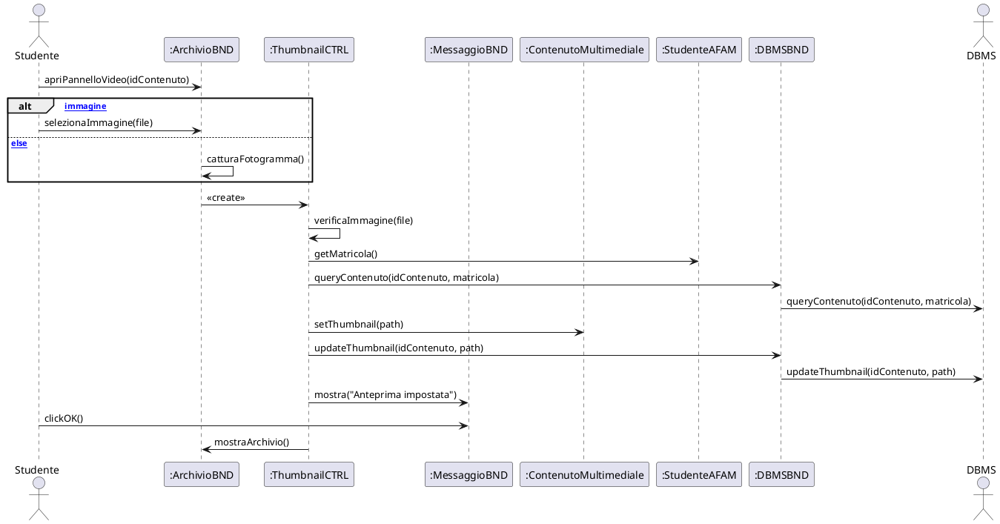

## C.4 Diagramma delle classi — Gestione Contenuti (PlantUML, funzioni complete)

```plantuml
@startuml CLS_GestioneContenuti
skinparam classAttributeIconSize 0
package "Gestione Contenuti" {

  class ArchivioBND <<boundary>> {
    +mostraArchivio()
    +clickCaricaContenuto()
    +selezionaFile(file)
    +inserisci(titolo, descrizione, visibilita)
    +clickCarica()
    +clickModifica(idContenuto)
    +modificaCampi(titolo, descrizione, visibilita)
    +clickSalva()
    +clickElimina(idContenuto)
    +apriPannelloVideo(idContenuto)
    +selezionaImmagine(file)
    +catturaFotogramma()
  }
  class MessaggioBND <<boundary>> { +mostra() +clickOK() +clickConferma() }
  class ErroreBND <<boundary>> { +mostra() +clickOK() }

  class CaricaContenutoCTRL <<control>> {
    +createCaricaContenuto()
    +verificaFile()
  }
  class ModificaContenutoCTRL <<control>> {
    +createModificaContenuto()
    +verificaFormato()
  }
  class EliminaContenutoCTRL <<control>> {
    +createEliminaContenuto()
  }
  class ThumbnailCTRL <<control>> {
    +createThumbnail()
    +verificaImmagine()
  }

  class ContenutoMultimediale <<entity>> {
    -idContenuto
    -titolo
    -descrizione
    -tipo
    -percorsoFile
    -thumbnailPath
    -visibilita
    -matricola
    +createContenuto()
    +getIdContenuto()
    +setTitolo()
    +setDescrizione()
    +setVisibilita()
    +setThumbnail()
  }
  class StudenteAFAM <<entity>> {
    -matricola
    +getMatricola()
  }

  class DBMSBND <<boundary>> {
    +queryContenuto()
    +queryContenuti()
    +insertContenuto()
    +updateContenuto()
    +updateThumbnail()
  }

  ArchivioBND ..> CaricaContenutoCTRL
  ArchivioBND ..> ModificaContenutoCTRL
  ArchivioBND ..> EliminaContenutoCTRL
  ArchivioBND ..> ThumbnailCTRL
  CaricaContenutoCTRL ..> ContenutoMultimediale
  CaricaContenutoCTRL ..> StudenteAFAM
  CaricaContenutoCTRL ..> DBMSBND
  ModificaContenutoCTRL ..> ContenutoMultimediale
  ModificaContenutoCTRL ..> StudenteAFAM
  ModificaContenutoCTRL ..> DBMSBND
  EliminaContenutoCTRL ..> ContenutoMultimediale
  EliminaContenutoCTRL ..> StudenteAFAM
  EliminaContenutoCTRL ..> DBMSBND
  ThumbnailCTRL ..> ContenutoMultimediale
  ThumbnailCTRL ..> StudenteAFAM
  ThumbnailCTRL ..> DBMSBND
}
@enduml
```

---
---

# SOTTOSISTEMA D — GESTIONE PORTFOLIO

## D.1 Diagramma dei casi d'uso (PlantUML)

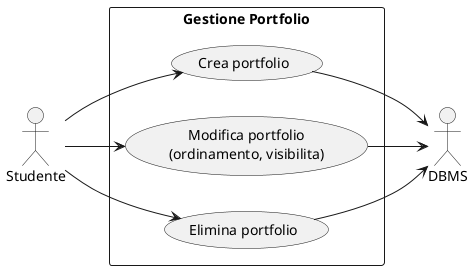

## D.2 Use case — flussi degli eventi

### CREA PORTFOLIO

| **Caso d'uso** | Crea portfolio |
|---|---|
| **ID** | CRE_PORT |
| **Attori** | • Studente • DBMS |
| **Precondizioni** | Il sistema ha mostrato la schermata "Gestione portfolio" |
| **Flusso eventi** | 1. Lo studente clicca "Nuovo portfolio" |
| | 2. Il sistema mostra il form di creazione con l'elenco dei contenuti dello studente |
| | 3. Lo studente inserisce il titolo del portfolio |
| | 4. Lo studente seleziona i contenuti da includere e ne definisce l'ordine (drag & drop) |
| | 5. Lo studente sceglie la visibilita (pubblico/privato) |
| | 6. Lo studente clicca "Crea" |
| | 7. Il sistema verifica che il titolo sia presente e che sia selezionato almeno un contenuto |
| | 8. **FINCHÉ** i dati non sono validi |
| | &nbsp;&nbsp; 8.1 Il sistema mostra il messaggio "Inserisci un titolo e almeno un contenuto" |
| | &nbsp;&nbsp; 8.2 Lo studente clicca "OK" |
| | &nbsp;&nbsp; 8.3 Lo studente corregge titolo e/o selezione |
| | &nbsp;&nbsp; 8.4 Il sistema verifica nuovamente i dati |
| | 9. Il sistema recupera la matricola dal token dell'utente |
| | 10. Il sistema, tramite DBMSBND, salva il portfolio con i contenuti nell'ordine scelto |
| | 11. Il sistema mostra il messaggio "Portfolio creato con successo" |
| | 12. Lo studente clicca "OK" |
| | 13. Il sistema mostra la schermata "Gestione portfolio" aggiornata |
| **Postcondizioni** | Il sistema ha mostrato la schermata "Gestione portfolio" aggiornata |
| **Note** | L'ordine dei contenuti è persistito (posizione). Solo i contenuti dello studente possono essere inclusi. |

### MODIFICA PORTFOLIO

| **Caso d'uso** | Modifica portfolio |
|---|---|
| **ID** | MOD_PORT |
| **Attori** | • Studente • DBMS |
| **Precondizioni** | Il sistema ha mostrato la schermata "Gestione portfolio" |
| **Flusso eventi** | 1. Lo studente clicca "Modifica" sulla card del portfolio |
| | 2. Il sistema recupera la matricola dal token dell'utente |
| | 3. Il sistema, tramite DBMSBND, verifica la proprietà e recupera il portfolio con i suoi contenuti |
| | 4. Il sistema mostra il form con titolo, contenuti selezionati (riordinabili) e disponibili |
| | 5. Lo studente modifica titolo, selezione, ordine (drag & drop) e/o visibilita |
| | 6. Lo studente clicca "Salva" |
| | 7. Il sistema verifica che il titolo sia presente e che sia selezionato almeno un contenuto |
| | 8. **FINCHÉ** i dati non sono validi |
| | &nbsp;&nbsp; 8.1 Il sistema mostra il messaggio "Inserisci un titolo e almeno un contenuto" |
| | &nbsp;&nbsp; 8.2 Lo studente clicca "OK" |
| | &nbsp;&nbsp; 8.3 Lo studente corregge titolo e/o selezione |
| | &nbsp;&nbsp; 8.4 Il sistema verifica nuovamente i dati |
| | 9. Il sistema, tramite DBMSBND, aggiorna il portfolio (contenuti, ordine, visibilita) |
| | 10. Il sistema mostra il messaggio "Portfolio aggiornato con successo" |
| | 11. Lo studente clicca "OK" |
| | 12. Il sistema mostra la schermata "Gestione portfolio" aggiornata |
| **Postcondizioni** | Il sistema ha mostrato la schermata "Gestione portfolio" aggiornata |
| **Note** | Il salvataggio sostituisce integralmente la collezione dei contenuti, preservando l'ordine impostato. |

### ELIMINA PORTFOLIO

| **Caso d'uso** | Elimina portfolio |
|---|---|
| **ID** | DEL_PORT |
| **Attori** | • Studente • DBMS |
| **Precondizioni** | Il sistema ha mostrato la schermata "Gestione portfolio" |
| **Flusso eventi** | 1. Lo studente clicca "Elimina" sulla card del portfolio |
| | 2. Il sistema mostra il messaggio "Sei sicuro di voler eliminare il portfolio?" |
| | 3. Lo studente clicca "Conferma" |
| | 4. Il sistema recupera la matricola dal token dell'utente |
| | 5. Il sistema, tramite DBMSBND, verifica la proprietà del portfolio |
| | 6. Il sistema, tramite DBMSBND, elimina il portfolio (i contenuti restano nell'archivio) |
| | 7. Il sistema mostra il messaggio "Portfolio eliminato" |
| | 8. Lo studente clicca "OK" |
| | 9. Il sistema mostra la schermata "Gestione portfolio" aggiornata |
| **Postcondizioni** | Il sistema ha mostrato la schermata "Gestione portfolio" aggiornata |
| **Note** | L'eliminazione del portfolio non elimina i contenuti multimediali associati, che restano nell'archivio dello studente. |

## D.3 Sequence diagram (PlantUML)

### SEQ — Crea portfolio

```plantuml
@startuml SEQ_CreaPortfolio
actor "Studente" as S
participant ":GestionePortfolioBND" as GEST
participant ":CreaPortfolioBND" as FORM
participant ":CreaPortfolioCTRL" as CTRL
participant ":ErroreBND" as ERR
participant ":MessaggioBND" as MSG
participant ":Portfolio" as PORT
participant ":StudenteAFAM" as STUD
participant ":DBMSBND" as DBMSB
actor "DBMS" as DBMS

S -> GEST : clickNuovoPortfolio()
GEST -> FORM : mostraForm()
S -> FORM : inserisci(titolo)
S -> FORM : selezionaContenuti(ids, ordine)
S -> FORM : selezionaVisibilita(visibilita)
S -> FORM : clickCrea()
FORM -> CTRL : <<create>>
CTRL -> CTRL : verificaDati(titolo, ids)

loop [dati non validi]
  CTRL -> ERR : mostra("Inserisci un titolo e almeno un contenuto")
  S -> ERR : clickOK()
  S -> FORM : inserisci(titolo)
  S -> FORM : selezionaContenuti(ids, ordine)
  CTRL -> CTRL : verificaDati(titolo, ids)
end

CTRL -> STUD : getMatricola()
CTRL -> PORT : createPortfolio(titolo, ids, ordine, visibilita)
CTRL -> DBMSB : insertPortfolio(portfolio, matricola)
DBMSB -> DBMS : insertPortfolio(portfolio, matricola)
CTRL -> MSG : mostra("Portfolio creato con successo")
S -> MSG : clickOK()
CTRL -> GEST : mostraGestionePortfolio()
@enduml
```

### SEQ — Modifica portfolio

```plantuml
@startuml SEQ_ModificaPortfolio
actor "Studente" as S
participant ":GestionePortfolioBND" as GEST
participant ":ModificaPortfolioBND" as FORM
participant ":ModificaPortfolioCTRL" as CTRL
participant ":ErroreBND" as ERR
participant ":MessaggioBND" as MSG
participant ":Portfolio" as PORT
participant ":StudenteAFAM" as STUD
participant ":DBMSBND" as DBMSB
actor "DBMS" as DBMS

S -> GEST : clickModifica(idPortfolio)
GEST -> CTRL : <<create>>
CTRL -> STUD : getMatricola()
CTRL -> DBMSB : queryPortfolio(idPortfolio, matricola)
DBMSB -> DBMS : queryPortfolio(idPortfolio, matricola)
CTRL -> FORM : mostraForm(portfolio, contenuti)
S -> FORM : modifica(titolo, ids, ordine, visibilita)
S -> FORM : clickSalva()
CTRL -> CTRL : verificaDati(titolo, ids)

loop [dati non validi]
  CTRL -> ERR : mostra("Inserisci un titolo e almeno un contenuto")
  S -> ERR : clickOK()
  S -> FORM : modifica(titolo, ids, ordine, visibilita)
  CTRL -> CTRL : verificaDati(titolo, ids)
end

CTRL -> PORT : setTitolo() / setContenuti() / setVisibilita()
CTRL -> DBMSB : updatePortfolio(idPortfolio, titolo, ids, ordine, visibilita)
DBMSB -> DBMS : updatePortfolio(...)
CTRL -> MSG : mostra("Portfolio aggiornato con successo")
S -> MSG : clickOK()
CTRL -> GEST : mostraGestionePortfolio()
@enduml
```

### SEQ — Elimina portfolio

```plantuml
@startuml SEQ_EliminaPortfolio
actor "Studente" as S
participant ":GestionePortfolioBND" as GEST
participant ":EliminaPortfolioCTRL" as CTRL
participant ":MessaggioBND" as MSG
participant ":Portfolio" as PORT
participant ":StudenteAFAM" as STUD
participant ":DBMSBND" as DBMSB
actor "DBMS" as DBMS

S -> GEST : clickElimina(idPortfolio)
GEST -> CTRL : <<create>>
CTRL -> MSG : mostra("Sei sicuro di voler eliminare il portfolio?")
S -> MSG : clickConferma()
CTRL -> STUD : getMatricola()
CTRL -> DBMSB : queryPortfolio(idPortfolio, matricola)
DBMSB -> DBMS : queryPortfolio(idPortfolio, matricola)
CTRL -> DBMSB : deletePortfolio(idPortfolio)
DBMSB -> DBMS : deletePortfolio(idPortfolio)
CTRL -> MSG : mostra("Portfolio eliminato")
S -> MSG : clickOK()
CTRL -> GEST : mostraGestionePortfolio()
@enduml
```

## D.4 Diagramma delle classi — Gestione Portfolio (PlantUML, funzioni complete)

```plantuml
@startuml CLS_GestionePortfolio
skinparam classAttributeIconSize 0
package "Gestione Portfolio" {

  class GestionePortfolioBND <<boundary>> {
    +mostraGestionePortfolio()
    +clickNuovoPortfolio()
    +clickModifica(idPortfolio)
    +clickElimina(idPortfolio)
  }
  class CreaPortfolioBND <<boundary>> {
    +mostraForm()
    +inserisci(titolo)
    +selezionaContenuti(ids, ordine)
    +selezionaVisibilita(visibilita)
    +clickCrea()
  }
  class ModificaPortfolioBND <<boundary>> {
    +mostraForm(portfolio, contenuti)
    +modifica(titolo, ids, ordine, visibilita)
    +clickSalva()
  }
  class MessaggioBND <<boundary>> { +mostra() +clickOK() +clickConferma() }
  class ErroreBND <<boundary>> { +mostra() +clickOK() }

  class CreaPortfolioCTRL <<control>> {
    +createCreaPortfolio()
    +verificaDati()
  }
  class ModificaPortfolioCTRL <<control>> {
    +createModificaPortfolio()
    +verificaDati()
  }
  class EliminaPortfolioCTRL <<control>> {
    +createEliminaPortfolio()
  }

  class Portfolio <<entity>> {
    -idPortfolio
    -titolo
    -visibilita
    -matricola
    -contenuti
    +createPortfolio()
    +getIdPortfolio()
    +setTitolo()
    +setContenuti()
    +setVisibilita()
  }
  class StudenteAFAM <<entity>> {
    -matricola
    +getMatricola()
  }

  class DBMSBND <<boundary>> {
    +queryPortfolio()
    +insertPortfolio()
    +updatePortfolio()
    +deletePortfolio()
  }

  GestionePortfolioBND ..> CreaPortfolioCTRL
  GestionePortfolioBND ..> ModificaPortfolioCTRL
  GestionePortfolioBND ..> EliminaPortfolioCTRL
  CreaPortfolioCTRL ..> Portfolio
  CreaPortfolioCTRL ..> StudenteAFAM
  CreaPortfolioCTRL ..> DBMSBND
  ModificaPortfolioCTRL ..> Portfolio
  ModificaPortfolioCTRL ..> StudenteAFAM
  ModificaPortfolioCTRL ..> DBMSBND
  EliminaPortfolioCTRL ..> Portfolio
  EliminaPortfolioCTRL ..> StudenteAFAM
  EliminaPortfolioCTRL ..> DBMSBND
}
@enduml
```

---
---

# SOTTOSISTEMA E — GESTIONE CONDIVISIONE

## E.1 Diagramma dei casi d'uso (PlantUML)

```plantuml
@startuml UC_GestioneCondivisione
left to right direction
skinparam packageStyle rectangle
actor "Studente" as ST
actor "DBMS" as DB
rectangle "Gestione Condivisione" {
  usecase "Genera link\ncondivisione" as UC_GEN
  usecase "Visualizza notifiche\ne storico condivisioni" as UC_NOT
}
ST --> UC_GEN
ST --> UC_NOT
UC_GEN --> DB
UC_NOT --> DB
@enduml
```

## E.2 Use case — flussi degli eventi

### GENERA LINK CONDIVISIONE

| **Caso d'uso** | Genera link condivisione |
|---|---|
| **ID** | GEN_LINK |
| **Attori** | • Studente • DBMS |
| **Precondizioni** | Il sistema ha mostrato la schermata "Gestione portfolio" |
| **Flusso eventi** | 1. Lo studente clicca "Condividi" sulla card di un portfolio |
| | 2. Il sistema recupera la matricola dal token dell'utente |
| | 3. Il sistema, tramite DBMSBND, verifica che il portfolio appartenga allo studente |
| | 4. Il sistema genera un token univoco (SecureRandom) e imposta la data di scadenza |
| | 5. Il sistema, tramite DBMSBND, salva il link di condivisione |
| | 6. Il sistema mostra il messaggio "Link generato" con l'URL da copiare |
| | 7. Lo studente clicca "Copia link" |
| | 8. Il sistema copia l'URL negli appunti e mostra "Link copiato" |
| | 9. Lo studente clicca "OK" |
| | 10. Il sistema mostra la schermata "Gestione portfolio" |
| **Postcondizioni** | Il sistema ha mostrato la schermata "Gestione portfolio" |
| **Note** | Il link consente l'accesso pubblico e anonimo al portfolio condiviso fino alla scadenza; ogni apertura incrementa il contatore delle visualizzazioni. |

### VISUALIZZA NOTIFICHE E STORICO CONDIVISIONI

| **Caso d'uso** | Visualizza notifiche e storico condivisioni |
|---|---|
| **ID** | VIS_NOT |
| **Attori** | • Studente • DBMS |
| **Precondizioni** | Lo studente è autenticato |
| **Flusso eventi** | 1. Lo studente clicca l'icona delle notifiche nella barra di navigazione |
| | 2. Il sistema recupera la matricola dal token dell'utente |
| | 3. Il sistema, tramite DBMSBND, richiede le notifiche non lette dello studente |
| | 4. Il sistema mostra a video l'elenco delle notifiche (aperture dei link condivisi) |
| | 5. **SE** sono presenti notifiche non lette |
| | &nbsp;&nbsp; 5.1 Lo studente clicca "Segna tutte come lette" |
| | &nbsp;&nbsp; 5.2 Il sistema, tramite DBMSBND, marca le notifiche come lette |
| | 6. Lo studente clicca "Storico condivisioni" |
| | 7. Il sistema, tramite DBMSBND, richiede lo storico dei link generati dallo studente |
| | 8. Il sistema mostra l'elenco dei link con stato, scadenza e numero di visualizzazioni |
| **Postcondizioni** | Il sistema ha mostrato lo storico delle condivisioni |
| **Note** | Le notifiche informano lo studente dell'apertura anonima dei propri link condivisi. |

## E.3 Sequence diagram (PlantUML)

### SEQ — Genera link condivisione

```plantuml
@startuml SEQ_GeneraLink
actor "Studente" as S
participant ":GestionePortfolioBND" as GEST
participant ":GeneraLinkCTRL" as CTRL
participant ":MessaggioBND" as MSG
participant ":LinkCondivisione" as LINK
participant ":StudenteAFAM" as STUD
participant ":DBMSBND" as DBMSB
actor "DBMS" as DBMS

S -> GEST : clickCondividi(idPortfolio)
GEST -> CTRL : <<create>>
CTRL -> STUD : getMatricola()
CTRL -> DBMSB : queryPortfolio(idPortfolio, matricola)
DBMSB -> DBMS : queryPortfolio(idPortfolio, matricola)
CTRL -> CTRL : generaTokenUnivoco()
CTRL -> LINK : createLink(token, idPortfolio, dataScadenza)
CTRL -> DBMSB : insertLink(link, matricola)
DBMSB -> DBMS : insertLink(link, matricola)
CTRL -> MSG : mostra("Link generato", url)
S -> MSG : clickCopiaLink()
CTRL -> MSG : mostra("Link copiato")
S -> MSG : clickOK()
CTRL -> GEST : mostraGestionePortfolio()
@enduml
```

### SEQ — Visualizza notifiche e storico

```plantuml
@startuml SEQ_VisualizzaNotifiche
actor "Studente" as S
participant ":NotificheBND" as NOT
participant ":NotificheCTRL" as CTRL
participant ":StudenteAFAM" as STUD
participant ":DBMSBND" as DBMSB
actor "DBMS" as DBMS

S -> NOT : clickNotifiche()
NOT -> CTRL : <<create>>
CTRL -> STUD : getMatricola()
CTRL -> DBMSB : queryNotificheNonLette(matricola)
DBMSB -> DBMS : queryNotificheNonLette(matricola)
CTRL -> NOT : mostraNotifiche(elenco)

alt [notifiche non lette presenti]
  S -> NOT : clickSegnaLette()
  CTRL -> DBMSB : updateNotificheLette(matricola)
  DBMSB -> DBMS : updateNotificheLette(matricola)
else [else]
end

S -> NOT : clickStoricoCondivisioni()
CTRL -> DBMSB : queryStoricoLink(matricola)
DBMSB -> DBMS : queryStoricoLink(matricola)
CTRL -> NOT : mostraStorico(link)
@enduml
```

## E.4 Diagramma delle classi — Gestione Condivisione (PlantUML, funzioni complete)

```plantuml
@startuml CLS_GestioneCondivisione
skinparam classAttributeIconSize 0
package "Gestione Condivisione" {

  class GestionePortfolioBND <<boundary>> {
    +mostraGestionePortfolio()
    +clickCondividi(idPortfolio)
  }
  class NotificheBND <<boundary>> {
    +clickNotifiche()
    +mostraNotifiche(elenco)
    +clickSegnaLette()
    +clickStoricoCondivisioni()
    +mostraStorico(link)
  }
  class MessaggioBND <<boundary>> {
    +mostra()
    +clickOK()
    +clickCopiaLink()
  }

  class GeneraLinkCTRL <<control>> {
    +createGeneraLink()
    +generaTokenUnivoco()
  }
  class NotificheCTRL <<control>> {
    +createNotifiche()
  }

  class LinkCondivisione <<entity>> {
    -tokenUnivoco
    -idPortfolio
    -matricola
    -dataScadenza
    -numeroVisualizzazioni
    -stato
    +createLink()
    +getToken()
    +getDataScadenza()
    +incrementaVisualizzazioni()
    +setStato()
  }
  class NotificaSistema <<entity>> {
    -idNotifica
    -matricola
    -messaggio
    -letta
    +createNotifica()
    +setLetta()
  }
  class StudenteAFAM <<entity>> {
    -matricola
    +getMatricola()
  }

  class DBMSBND <<boundary>> {
    +queryPortfolio()
    +insertLink()
    +queryNotificheNonLette()
    +updateNotificheLette()
    +queryStoricoLink()
  }

  GestionePortfolioBND ..> GeneraLinkCTRL
  NotificheBND ..> NotificheCTRL
  GeneraLinkCTRL ..> LinkCondivisione
  GeneraLinkCTRL ..> StudenteAFAM
  GeneraLinkCTRL ..> DBMSBND
  NotificheCTRL ..> NotificaSistema
  NotificheCTRL ..> StudenteAFAM
  NotificheCTRL ..> DBMSBND
}
@enduml
```

---
---

# SOTTOSISTEMA F — CONSULTAZIONE PUBBLICA

## F.1 Diagramma dei casi d'uso (PlantUML)

```plantuml
@startuml UC_ConsultazionePubblica
left to right direction
skinparam packageStyle rectangle
actor "Utente Esterno" as UE
actor "DBMS" as DB
rectangle "Consultazione Pubblica" {
  usecase "Bacheca pubblica\n(index)" as UC_BAC
  usecase "Ricerca studenti" as UC_RIC
  usecase "Profilo pubblico\n(opere e portfolio)" as UC_PRO
  usecase "Accesso tramite\nlink condiviso" as UC_LINK
}
UE --> UC_BAC
UE --> UC_RIC
UE --> UC_PRO
UE --> UC_LINK
UC_BAC --> DB
UC_RIC --> DB
UC_PRO --> DB
UC_LINK --> DB
@enduml
```

## F.2 Use case — flussi degli eventi

### BACHECA PUBBLICA (INDEX)

| **Caso d'uso** | Bacheca pubblica |
|---|---|
| **ID** | BACHECA |
| **Attori** | • Utente Esterno • DBMS |
| **Precondizioni** | Nessuna (schermata iniziale del sistema) |
| **Flusso eventi** | 1. L'utente esterno apre il sistema |
| | 2. Il sistema, tramite DBMSBND, richiede i contenuti pubblici più recenti |
| | 3. Il sistema mostra a video la "Bacheca pubblica" con le opere pubbliche degli studenti |
| | 4. L'utente esterno clicca su una card di contenuto |
| | 5. Il sistema apre l'anteprima del contenuto in una finestra dedicata |
| **Postcondizioni** | Il sistema ha mostrato la "Bacheca pubblica" |
| **Note** | La bacheca è l'index del sistema, accessibile senza autenticazione; mostra solo contenuti con visibilita PUBBLICO. |

### RICERCA STUDENTI

| **Caso d'uso** | Ricerca studenti |
|---|---|
| **ID** | RIC_STUD |
| **Attori** | • Utente Esterno • DBMS |
| **Precondizioni** | Il sistema ha mostrato la "Bacheca pubblica" |
| **Flusso eventi** | 1. L'utente esterno clicca l'icona di ricerca nella barra di navigazione |
| | 2. Il sistema espande il campo di ricerca |
| | 3. L'utente esterno digita il nome o la matricola dello studente |
| | 4. Il sistema, tramite DBMSBND, interroga il DBMS per i profili corrispondenti |
| | 5. **FINCHÉ** l'utente esterno continua a digitare |
| | &nbsp;&nbsp; 5.1 Il sistema aggiorna dinamicamente l'elenco dei risultati |
| | 6. L'utente esterno clicca su un profilo tra i risultati |
| | 7. Il sistema mostra la schermata "Profilo pubblico" dello studente selezionato |
| **Postcondizioni** | Il sistema ha mostrato la schermata "Profilo pubblico" |
| **Note** | La ricerca avviene con debounce lato client; vengono mostrati solo profili con visibilita pubblica. |

### PROFILO PUBBLICO (OPERE E PORTFOLIO)

| **Caso d'uso** | Profilo pubblico |
|---|---|
| **ID** | PROF_PUB |
| **Attori** | • Utente Esterno • DBMS |
| **Precondizioni** | Il sistema ha mostrato la schermata "Profilo pubblico" |
| **Flusso eventi** | 1. Il sistema, tramite DBMSBND, richiede i dati pubblici del profilo, le opere e i portfolio pubblici dello studente |
| | 2. Il sistema mostra il profilo con anteprime di opere e portfolio |
| | 3. L'utente esterno clicca "Vedi tutte le opere" oppure "Vedi tutti i portfolio" |
| | 4. Il sistema mostra l'elenco completo degli elementi pubblici richiesti |
| | 5. L'utente esterno clicca su un portfolio |
| | 6. Il sistema, tramite DBMSBND, recupera i contenuti del portfolio |
| | 7. Il sistema mostra la schermata "Visualizzatore portfolio" |
| **Postcondizioni** | Il sistema ha mostrato il portfolio pubblico dello studente |
| **Note** | Vengono mostrati esclusivamente contenuti e portfolio con visibilita PUBBLICO. |

### ACCESSO TRAMITE LINK CONDIVISO

| **Caso d'uso** | Accesso tramite link condiviso |
|---|---|
| **ID** | ACC_LINK |
| **Attori** | • Utente Esterno • DBMS |
| **Precondizioni** | L'utente esterno ha ricevuto un link di condivisione |
| **Flusso eventi** | 1. L'utente esterno apre l'URL del link condiviso |
| | 2. Il sistema, tramite DBMSBND, valida il token del link |
| | 3. **SE** il link è valido e non scaduto |
| | &nbsp;&nbsp; 3.1 Il sistema, tramite DBMSBND, incrementa il contatore delle visualizzazioni e registra una notifica per lo studente |
| | &nbsp;&nbsp; 3.2 Il sistema, tramite DBMSBND, recupera i contenuti del portfolio condiviso |
| | &nbsp;&nbsp; 3.3 Il sistema mostra la schermata "Visualizzatore link" con i contenuti condivisi |
| | 4. **ALTRIMENTI** |
| | &nbsp;&nbsp; 4.1 Il sistema mostra il messaggio "Link non valido o scaduto" |
| | &nbsp;&nbsp; 4.2 Il sistema reindirizza alla "Bacheca pubblica" |
| **Postcondizioni** | Il sistema ha mostrato i contenuti condivisi, oppure la "Bacheca pubblica" se il link non è valido |
| **Note** | L'accesso è anonimo; l'apertura del link è tracciata (contatore + notifica al proprietario). |

## F.3 Sequence diagram (PlantUML)

### SEQ — Bacheca pubblica

```plantuml
@startuml SEQ_BachecaPubblica
actor "Utente Esterno" as UE
participant ":BachecaPubblicaBND" as HOME
participant ":BachecaCTRL" as CTRL
participant ":DBMSBND" as DBMSB
actor "DBMS" as DBMS

UE -> HOME : apriSistema()
HOME -> CTRL : <<create>>
CTRL -> DBMSB : queryContenutiPubblici()
DBMSB -> DBMS : queryContenutiPubblici()
CTRL -> HOME : mostraBacheca(contenuti)
UE -> HOME : clickContenuto(idContenuto)
HOME -> HOME : apriAnteprima(idContenuto)
@enduml
```

### SEQ — Ricerca studenti

```plantuml
@startuml SEQ_RicercaStudenti
actor "Utente Esterno" as UE
participant ":BachecaPubblicaBND" as HOME
participant ":RicercaCTRL" as CTRL
participant ":ProfiloPubblicoBND" as PROF
participant ":DBMSBND" as DBMSB
actor "DBMS" as DBMS

UE -> HOME : clickRicerca()
HOME -> CTRL : <<create>>
UE -> HOME : digita(query)

loop [utente continua a digitare]
  CTRL -> DBMSB : queryProfili(query)
  DBMSB -> DBMS : queryProfili(query)
  CTRL -> HOME : aggiornaRisultati(profili)
  UE -> HOME : digita(query)
end

UE -> HOME : clickProfilo(matricola)
CTRL -> PROF : mostraProfiloPubblico(matricola)
@enduml
```

### SEQ — Profilo pubblico

```plantuml
@startuml SEQ_ProfiloPubblico
actor "Utente Esterno" as UE
participant ":ProfiloPubblicoBND" as PROF
participant ":ProfiloPubblicoCTRL" as CTRL
participant ":VisualizzatorePortfolioBND" as VIS
participant ":DBMSBND" as DBMSB
actor "DBMS" as DBMS

PROF -> CTRL : <<create>>
CTRL -> DBMSB : queryProfiloPubblico(matricola)
DBMSB -> DBMS : queryProfiloPubblico(matricola)
CTRL -> DBMSB : queryOperePubbliche(matricola)
DBMSB -> DBMS : queryOperePubbliche(matricola)
CTRL -> DBMSB : queryPortfolioPubblici(matricola)
DBMSB -> DBMS : queryPortfolioPubblici(matricola)
CTRL -> PROF : mostraProfilo(profilo, opere, portfolios)
UE -> PROF : clickPortfolio(idPortfolio)
CTRL -> DBMSB : queryContenutiPortfolio(idPortfolio)
DBMSB -> DBMS : queryContenutiPortfolio(idPortfolio)
CTRL -> VIS : mostraVisualizzatorePortfolio(contenuti)
@enduml
```

### SEQ — Accesso tramite link condiviso

```plantuml
@startuml SEQ_AccessoLink
actor "Utente Esterno" as UE
participant ":VisualizzatoreLinkBND" as VIS
participant ":AccessoLinkCTRL" as CTRL
participant ":BachecaPubblicaBND" as HOME
participant ":LinkCondivisione" as LINK
participant ":DBMSBND" as DBMSB
actor "DBMS" as DBMS

UE -> VIS : apriLink(token)
VIS -> CTRL : <<create>>
CTRL -> DBMSB : queryLink(token)
DBMSB -> DBMS : queryLink(token)
CTRL -> LINK : validaToken()

alt [link valido e non scaduto]
  CTRL -> LINK : incrementaVisualizzazioni()
  CTRL -> DBMSB : updateVisualizzazioni(token)
  DBMSB -> DBMS : updateVisualizzazioni(token)
  CTRL -> DBMSB : insertNotifica(matricolaProprietario)
  DBMSB -> DBMS : insertNotifica(matricolaProprietario)
  CTRL -> DBMSB : queryContenutiPortfolio(idPortfolio)
  DBMSB -> DBMS : queryContenutiPortfolio(idPortfolio)
  CTRL -> VIS : mostraContenutiCondivisi(contenuti)
else [else]
  CTRL -> VIS : mostra("Link non valido o scaduto")
  CTRL -> HOME : mostraBachecaPubblica()
end
@enduml
```

## F.4 Diagramma delle classi — Consultazione Pubblica (PlantUML, funzioni complete)

```plantuml
@startuml CLS_ConsultazionePubblica
skinparam classAttributeIconSize 0
package "Consultazione Pubblica" {

  class BachecaPubblicaBND <<boundary>> {
    +apriSistema()
    +mostraBacheca(contenuti)
    +clickContenuto(idContenuto)
    +apriAnteprima(idContenuto)
    +clickRicerca()
    +digita(query)
    +aggiornaRisultati(profili)
    +clickProfilo(matricola)
    +mostraBachecaPubblica()
  }
  class ProfiloPubblicoBND <<boundary>> {
    +mostraProfiloPubblico(matricola)
    +mostraProfilo(profilo, opere, portfolios)
    +clickPortfolio(idPortfolio)
  }
  class VisualizzatorePortfolioBND <<boundary>> {
    +mostraVisualizzatorePortfolio(contenuti)
  }
  class VisualizzatoreLinkBND <<boundary>> {
    +apriLink(token)
    +mostraContenutiCondivisi(contenuti)
    +mostra(messaggio)
  }

  class BachecaCTRL <<control>> {
    +createBacheca()
  }
  class RicercaCTRL <<control>> {
    +createRicerca()
  }
  class ProfiloPubblicoCTRL <<control>> {
    +createProfiloPubblico()
  }
  class AccessoLinkCTRL <<control>> {
    +createAccessoLink()
  }

  class ContenutoMultimediale <<entity>> {
    -idContenuto
    -titolo
    -tipo
    -percorsoFile
    -thumbnailPath
    -visibilita
    +getIdContenuto()
    +getVisibilita()
  }
  class Portfolio <<entity>> {
    -idPortfolio
    -titolo
    -visibilita
    -contenuti
    +getIdPortfolio()
    +getContenuti()
  }
  class LinkCondivisione <<entity>> {
    -tokenUnivoco
    -idPortfolio
    -matricola
    -dataScadenza
    -numeroVisualizzazioni
    +validaToken()
    +incrementaVisualizzazioni()
  }
  class StudenteAFAM <<entity>> {
    -matricola
    -nome
    -cognome
    -avatarPath
    -visibilitaProfilo
    +getMatricola()
    +getDatiStudente()
  }

  class DBMSBND <<boundary>> {
    +queryContenutiPubblici()
    +queryProfili()
    +queryProfiloPubblico()
    +queryOperePubbliche()
    +queryPortfolioPubblici()
    +queryContenutiPortfolio()
    +queryLink()
    +updateVisualizzazioni()
    +insertNotifica()
  }

  BachecaPubblicaBND ..> BachecaCTRL
  BachecaPubblicaBND ..> RicercaCTRL
  ProfiloPubblicoBND ..> ProfiloPubblicoCTRL
  VisualizzatoreLinkBND ..> AccessoLinkCTRL
  BachecaCTRL ..> ContenutoMultimediale
  BachecaCTRL ..> DBMSBND
  RicercaCTRL ..> StudenteAFAM
  RicercaCTRL ..> DBMSBND
  ProfiloPubblicoCTRL ..> StudenteAFAM
  ProfiloPubblicoCTRL ..> ContenutoMultimediale
  ProfiloPubblicoCTRL ..> Portfolio
  ProfiloPubblicoCTRL ..> DBMSBND
  AccessoLinkCTRL ..> LinkCondivisione
  AccessoLinkCTRL ..> Portfolio
  AccessoLinkCTRL ..> DBMSBND
}
@enduml
```

---
---

# SOTTOSISTEMA G — SEGNALAZIONI

## G.1 Diagramma dei casi d'uso (PlantUML)

```plantuml
@startuml UC_Segnalazioni
left to right direction
skinparam packageStyle rectangle
actor "Utente Esterno" as UE
actor "Revisore" as RV
actor "DBMS" as DB
rectangle "Segnalazioni" {
  usecase "Invia segnalazione" as UC_INV
  usecase "Revisione segnalazioni\n(pendenti e storico)" as UC_REV
}
UE --> UC_INV
RV --> UC_REV
UC_INV --> DB
UC_REV --> DB
@enduml
```

## G.2 Use case — flussi degli eventi

### INVIA SEGNALAZIONE

| **Caso d'uso** | Invia segnalazione |
|---|---|
| **ID** | INV_SEG |
| **Attori** | • Utente Esterno • DBMS |
| **Precondizioni** | Il sistema ha mostrato un contenuto pubblico (bacheca o profilo pubblico) |
| **Flusso eventi** | 1. L'utente esterno clicca "Segnala" sul contenuto ritenuto inappropriato |
| | 2. Il sistema mostra il form di segnalazione |
| | 3. L'utente esterno seleziona la motivazione |
| | 4. L'utente esterno inserisce una descrizione libera |
| | 5. L'utente esterno clicca "Invia segnalazione" |
| | 6. Il sistema verifica che la motivazione sia selezionata |
| | 7. **FINCHÉ** la motivazione non è selezionata |
| | &nbsp;&nbsp; 7.1 Il sistema mostra il messaggio "Seleziona una motivazione" |
| | &nbsp;&nbsp; 7.2 L'utente esterno clicca "OK" |
| | &nbsp;&nbsp; 7.3 L'utente esterno seleziona la motivazione |
| | &nbsp;&nbsp; 7.4 Il sistema verifica la selezione |
| | 8. Il sistema, tramite DBMSBND, salva la segnalazione con stato IN_ATTESA |
| | 9. Il sistema mostra il messaggio "Segnalazione inviata con successo" |
| | 10. L'utente esterno clicca "OK" |
| | 11. Il sistema mostra la schermata precedente |
| **Postcondizioni** | Il sistema ha mostrato la schermata precedente |
| **Note** | La segnalazione può essere inviata anche da un utente non autenticato; nasce nello stato IN_ATTESA in attesa di revisione. |

### REVISIONE SEGNALAZIONI (PENDENTI E STORICO)

| **Caso d'uso** | Revisione segnalazioni |
|---|---|
| **ID** | REV_SEG |
| **Attori** | • Revisore • DBMS |
| **Precondizioni** | Il revisore è autenticato (ruolo REVISORE) |
| **Flusso eventi** | 1. Il revisore apre il "Pannello di revisione" |
| | 2. Il sistema, tramite DBMSBND, richiede le segnalazioni pendenti con il contenuto associato |
| | 3. Il sistema mostra l'elenco delle segnalazioni IN_ATTESA con l'anteprima del contenuto segnalato |
| | 4. Il revisore seleziona una segnalazione |
| | 5. Il sistema mostra il dettaglio con l'anteprima del contenuto segnalato |
| | 6. **SE** il revisore ritiene la segnalazione fondata |
| | &nbsp;&nbsp; 6.1 Il revisore clicca "Accogli" |
| | &nbsp;&nbsp; 6.2 Il sistema, tramite DBMSBND, marca il contenuto come RIMOSSO e la segnalazione come ACCOLTA |
| | 7. **ALTRIMENTI** |
| | &nbsp;&nbsp; 7.1 Il revisore clicca "Archivia" |
| | &nbsp;&nbsp; 7.2 Il sistema, tramite DBMSBND, marca la segnalazione come ARCHIVIATA senza rimuovere il contenuto |
| | 8. Il sistema aggiorna l'elenco delle segnalazioni pendenti |
| | 9. Il revisore clicca "Storico segnalazioni risolte" |
| | 10. Il sistema, tramite DBMSBND, richiede le segnalazioni ACCOLTA e ARCHIVIATA |
| | 11. Il sistema mostra lo storico con i relativi stati |
| **Postcondizioni** | Il sistema ha mostrato lo storico delle segnalazioni risolte |
| **Note** | Il revisore può visualizzare anche contenuti PRIVATO se oggetto di segnalazione. Accogliere rimuove il contenuto; archiviare chiude la segnalazione lasciando intatto il contenuto. |

## G.3 Sequence diagram (PlantUML)

### SEQ — Invia segnalazione

```plantuml
@startuml SEQ_InviaSegnalazione
actor "Utente Esterno" as UE
participant ":ProfiloPubblicoBND" as PROF
participant ":FormSegnalazioneBND" as FORM
participant ":SegnalazioneCTRL" as CTRL
participant ":ErroreBND" as ERR
participant ":MessaggioBND" as MSG
participant ":Segnalazione" as SEG
participant ":DBMSBND" as DBMSB
actor "DBMS" as DBMS

UE -> PROF : clickSegnala(idContenuto)
PROF -> FORM : mostraForm()
UE -> FORM : selezionaMotivazione(motivazione)
UE -> FORM : inserisciDescrizione(descrizione)
UE -> FORM : clickInvia()
FORM -> CTRL : <<create>>
CTRL -> CTRL : verificaMotivazione(motivazione)

loop [motivazione non selezionata]
  CTRL -> ERR : mostra("Seleziona una motivazione")
  UE -> ERR : clickOK()
  UE -> FORM : selezionaMotivazione(motivazione)
  CTRL -> CTRL : verificaMotivazione(motivazione)
end

CTRL -> SEG : createSegnalazione(idContenuto, motivazione, descrizione, IN_ATTESA)
CTRL -> DBMSB : insertSegnalazione(segnalazione)
DBMSB -> DBMS : insertSegnalazione(segnalazione)
CTRL -> MSG : mostra("Segnalazione inviata con successo")
UE -> MSG : clickOK()
CTRL -> PROF : mostraSchermataPrecedente()
@enduml
```

### SEQ — Revisione segnalazioni

```plantuml
@startuml SEQ_RevisioneSegnalazioni
actor "Revisore" as RV
participant ":PannelloRevisioneBND" as PAN
participant ":RevisioneCTRL" as CTRL
participant ":MessaggioBND" as MSG
participant ":Segnalazione" as SEG
participant ":ContenutoMultimediale" as CONT
participant ":DBMSBND" as DBMSB
actor "DBMS" as DBMS

RV -> PAN : apriPannelloRevisione()
PAN -> CTRL : <<create>>
CTRL -> DBMSB : querySegnalazioniPendenti()
DBMSB -> DBMS : querySegnalazioniPendenti()
CTRL -> PAN : mostraPendenti(segnalazioni)
RV -> PAN : selezionaSegnalazione(idSegnalazione)
CTRL -> PAN : mostraDettaglio(segnalazione, contenuto)

alt [segnalazione fondata]
  RV -> PAN : clickAccogli()
  CTRL -> CONT : setVisibilita(RIMOSSO)
  CTRL -> DBMSB : updateContenuto(idContenuto, RIMOSSO)
  DBMSB -> DBMS : updateContenuto(idContenuto, RIMOSSO)
  CTRL -> SEG : setStato(ACCOLTA)
  CTRL -> DBMSB : updateSegnalazione(idSegnalazione, ACCOLTA)
  DBMSB -> DBMS : updateSegnalazione(idSegnalazione, ACCOLTA)
else [else]
  RV -> PAN : clickArchivia()
  CTRL -> SEG : setStato(ARCHIVIATA)
  CTRL -> DBMSB : updateSegnalazione(idSegnalazione, ARCHIVIATA)
  DBMSB -> DBMS : updateSegnalazione(idSegnalazione, ARCHIVIATA)
end

CTRL -> PAN : aggiornaPendenti()
RV -> PAN : clickStorico()
CTRL -> DBMSB : querySegnalazioniRisolte()
DBMSB -> DBMS : querySegnalazioniRisolte()
CTRL -> PAN : mostraStorico(segnalazioni)
@enduml
```

## G.4 Diagramma delle classi — Segnalazioni (PlantUML, funzioni complete)

```plantuml
@startuml CLS_Segnalazioni
skinparam classAttributeIconSize 0
package "Segnalazioni" {

  class ProfiloPubblicoBND <<boundary>> {
    +clickSegnala(idContenuto)
    +mostraSchermataPrecedente()
  }
  class FormSegnalazioneBND <<boundary>> {
    +mostraForm()
    +selezionaMotivazione(motivazione)
    +inserisciDescrizione(descrizione)
    +clickInvia()
  }
  class PannelloRevisioneBND <<boundary>> {
    +apriPannelloRevisione()
    +mostraPendenti(segnalazioni)
    +selezionaSegnalazione(idSegnalazione)
    +mostraDettaglio(segnalazione, contenuto)
    +clickAccogli()
    +clickArchivia()
    +aggiornaPendenti()
    +clickStorico()
    +mostraStorico(segnalazioni)
  }
  class MessaggioBND <<boundary>> { +mostra() +clickOK() }
  class ErroreBND <<boundary>> { +mostra() +clickOK() }

  class SegnalazioneCTRL <<control>> {
    +createSegnalazione()
    +verificaMotivazione()
  }
  class RevisioneCTRL <<control>> {
    +createRevisione()
  }

  class Segnalazione <<entity>> {
    -idSegnalazione
    -idContenuto
    -matricolaAutore
    -motivazione
    -descrizioneLibera
    -stato
    -dataInvio
    +createSegnalazione()
    +getIdSegnalazione()
    +getIdContenuto()
    +setStato()
  }
  class ContenutoMultimediale <<entity>> {
    -idContenuto
    -visibilita
    +getIdContenuto()
    +setVisibilita()
  }

  class DBMSBND <<boundary>> {
    +insertSegnalazione()
    +querySegnalazioniPendenti()
    +querySegnalazioniRisolte()
    +updateSegnalazione()
    +updateContenuto()
  }

  ProfiloPubblicoBND ..> SegnalazioneCTRL
  FormSegnalazioneBND ..> SegnalazioneCTRL
  PannelloRevisioneBND ..> RevisioneCTRL
  SegnalazioneCTRL ..> Segnalazione
  SegnalazioneCTRL ..> DBMSBND
  RevisioneCTRL ..> Segnalazione
  RevisioneCTRL ..> ContenutoMultimediale
  RevisioneCTRL ..> DBMSBND
}
@enduml
```

---
---

# APPENDICE — DIAGRAMMA COMPLESSIVO DELLE ENTITY

> Come nell'esempio 30/30, si riporta il diagramma d'insieme delle entità di dominio persistenti.

```plantuml
@startuml CLS_Entities
skinparam classAttributeIconSize 0
package "Entities" {

  class StudenteAFAM <<entity>> {
    -matricola
    -nome
    -cognome
    -emailIstituzionale
    -bio
    -avatarPath
    -visibilitaProfilo
    +createStudente()
    +getMatricola()
    +getDatiStudente()
    +getEmail()
    +setEmail()
    +setNome()
    +setBio()
    +setAvatar()
    +setVisibilita()
  }

  class CredenzialiSicurezza <<entity>> {
    -matricola
    -passwordHash
    -segretoTOTP
    -ruolo
    +getPasswordHash()
    +getSegretoTOTP()
    +getRuolo()
    +setPasswordHash()
  }

  class ContenutoMultimediale <<entity>> {
    -idContenuto
    -titolo
    -descrizione
    -tipo
    -percorsoFile
    -thumbnailPath
    -visibilita
    -matricola
    +createContenuto()
    +getIdContenuto()
    +setTitolo()
    +setDescrizione()
    +setVisibilita()
    +setThumbnail()
  }

  class Portfolio <<entity>> {
    -idPortfolio
    -titolo
    -visibilita
    -matricola
    -contenuti
    +createPortfolio()
    +getIdPortfolio()
    +setTitolo()
    +setContenuti()
    +setVisibilita()
  }

  class LinkCondivisione <<entity>> {
    -tokenUnivoco
    -idPortfolio
    -matricola
    -dataScadenza
    -numeroVisualizzazioni
    -stato
    +createLink()
    +getToken()
    +getDataScadenza()
    +incrementaVisualizzazioni()
    +setStato()
  }

  class Segnalazione <<entity>> {
    -idSegnalazione
    -idContenuto
    -matricolaAutore
    -motivazione
    -descrizioneLibera
    -stato
    -dataInvio
    +createSegnalazione()
    +getIdSegnalazione()
    +getIdContenuto()
    +setStato()
  }

  class NotificaSistema <<entity>> {
    -idNotifica
    -matricola
    -messaggio
    -letta
    -dataCreazione
    +createNotifica()
    +setLetta()
  }

  class IdentitaFederata <<entity>> {
    -idFederato
    -matricola
    -idIstitutoEsterno
    -dataAttivazione
    +createIdentitaFederata()
    +getIdFederato()
  }

  class TokenResetPassword <<entity>> {
    -token
    -matricola
    -dataScadenza
    +createToken()
    +getToken()
    +isScaduto()
  }

  StudenteAFAM "1" -- "1" CredenzialiSicurezza
  StudenteAFAM "1" -- "0..*" ContenutoMultimediale
  StudenteAFAM "1" -- "0..*" Portfolio
  StudenteAFAM "1" -- "0..*" NotificaSistema
  StudenteAFAM "1" -- "0..1" IdentitaFederata
  StudenteAFAM "1" -- "0..*" TokenResetPassword
  Portfolio "1" -- "0..*" ContenutoMultimediale
  Portfolio "1" -- "0..*" LinkCondivisione
  ContenutoMultimediale "1" -- "0..*" Segnalazione
}
@enduml
```

---
---

# GUIDA ALLA RICOSTRUZIONE IN ASTAH

I blocchi PlantUML sopra sono direttamente renderizzabili (plantuml.com/plantuml o estensione IDE).
Per ricrearli identici in **Astah** seguendo lo stile dell'esempio 30/30:

### Diagrammi dei casi d'uso
1. Nuovo *Use Case Diagram* per ogni sottosistema.
2. Trascina un rettangolo di sistema (package) e rinominalo come il sottosistema.
3. Aggiungi gli attori a sinistra (Studente/Utente Esterno/Revisore) e a destra (DBMS, provider).
4. Inserisci gli ovali dei casi d'uso dentro il rettangolo.
5. Collega attori e UC con associazioni; usa frecce tratteggiate `<<include>>` tra UC.

### Sequence diagram
1. Nuovo *Sequence Diagram* per ogni UC.
2. Crea le lifeline nell'ordine: attore → BND → CTRL → MessaggioBND/ErroreBND → Entity → DBMSBND → DBMS → provider.
3. Applica gli stereotipi: `<<boundary>>` (BND e DBMSBND), `<<control>>` (CTRL), `<<entity>>` (StudenteAFAM, ecc.).
4. Il CTRL si crea con messaggio `<<create>>` dalla BND.
5. **FINCHÉ** → *Combined Fragment* tipo `loop` con la guardia tra `[ ]`.
6. **SE/ALTRIMENTI** → *Combined Fragment* tipo `alt` con due operandi e due guardie.
7. Invocazione di altro UC → *Interaction Use* (`ref`).
8. Ricorda: prima di ogni chiamata a `DBMS` deve esserci la chiamata a `DBMSBND`; quando si usano dati legati al token, inserisci prima il messaggio `getMatricola()` verso `StudenteAFAM`.

### Diagrammi delle classi
1. Nuovo *Class Diagram* per ogni sottosistema (+ uno complessivo Entities).
2. Una classe per ogni BND/CTRL/Entity con lo stereotipo corrispondente.
3. Inserisci **tutte** le funzioni usate nel sottosistema in ciascuna classe (come nell'esempio 30/30).
4. Collega con dipendenze `..>` BND→CTRL, CTRL→Entity, CTRL→DBMSBND.
